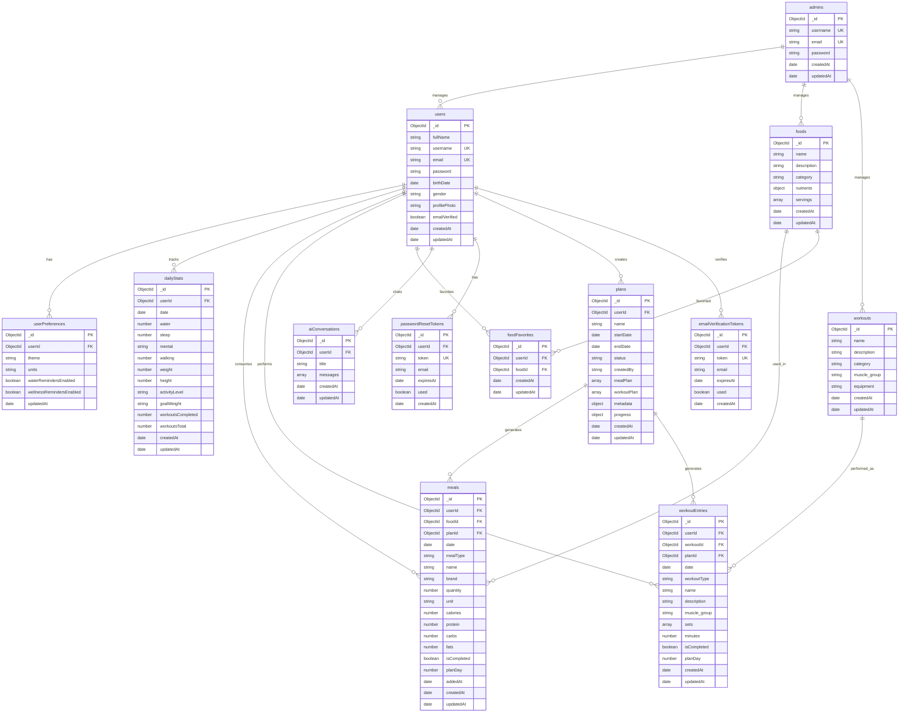

# CoreIQ MongoDB Schema Diagram

## Visual Schema Diagram



---

## Detailed MongoDB Schema Structure

### Collection: `users`
```javascript
{
  _id: ObjectId,                    // Primary Key
  fullName: String,
  username: String,                 // Unique Index
  email: String,                    // Unique Index
  password: String,                 // Hashed with bcrypt
  birthDate: Date,
  gender: String,                   // 'male' | 'female'
  profilePhoto: String,             // Optional
  emailVerified: Boolean,
  createdAt: Date,
  updatedAt: Date
}
```

### Collection: `userPreferences`
```javascript
{
  _id: ObjectId,
  userId: ObjectId,                 // FK → users._id (Unique Index)
  theme: String,                    // 'light' | 'dark'
  units: String,                    // 'metric' | 'imperial'
  waterRemindersEnabled: Boolean,
  wellnessRemindersEnabled: Boolean,
  updatedAt: Date
}
```

### Collection: `dailyStats`
```javascript
{
  _id: ObjectId,
  userId: ObjectId,                 // FK → users._id
  date: Date,                       // Compound Index: {userId, date}
  water: Number,                    // ml
  sleep: Number,                    // hours
  mental: String,                   // Enum: 'Motivated', 'Neutral', 'Stressed', etc.
  walking: Number,                  // steps
  weight: Number,                   // kg
  height: Number,                   // cm
  activityLevel: String,            // Enum: 'Sedentary', 'Light', 'Moderate', etc.
  goalWeight: String,               // e.g., 'Lose Weight: 75kg'
  workoutsCompleted: Number,
  workoutsTotal: Number,
  createdAt: Date,
  updatedAt: Date
}
```

### Collection: `foods`
```javascript
{
  _id: ObjectId,
  name: String,                     // Indexed
  description: String,
  category: String,                 // Indexed
  nutrients: {                      // Embedded Object
    calories: Number,               // Per 100g
    protein: Number,
    fat: Number,
    carbs: Number
  },
  servings: [{                     // Embedded Array
    size: String,
    calories: Number,
    protein: Number,
    fat: Number,
    carbs: Number
  }],
  createdAt: Date,
  updatedAt: Date
}
```

### Collection: `meals`
```javascript
{
  _id: ObjectId,
  userId: ObjectId,                 // FK → users._id
  foodId: ObjectId,                 // FK → foods._id
  planId: ObjectId,                 // FK → plans._id (Optional)
  date: Date,                       // Compound Index: {userId, date, mealType}
  mealType: String,                 // Enum: 'Breakfast', 'Snack 1', etc.
  name: String,                     // Denormalized from foods
  brand: String,
  quantity: Number,
  unit: String,                     // 'grams' | 'servings'
  calories: Number,                 // Calculated
  protein: Number,                  // Calculated
  carbs: Number,                    // Calculated
  fats: Number,                     // Calculated
  isCompleted: Boolean,
  planDay: Number,                  // 1-14 (Optional)
  addedAt: Date,
  createdAt: Date,
  updatedAt: Date
}
```

### Collection: `workouts`
```javascript
{
  _id: ObjectId,
  name: String,                     // Indexed
  description: String,
  category: String,                 // 'Strength' | 'Cardio'
  muscle_group: String,             // Indexed
  equipment: String,
  createdAt: Date,
  updatedAt: Date
}
```

### Collection: `workoutEntries`
```javascript
{
  _id: ObjectId,
  userId: ObjectId,                 // FK → users._id
  workoutId: ObjectId,             // FK → workouts._id
  planId: ObjectId,                 // FK → plans._id (Optional)
  date: Date,                       // Compound Index: {userId, date}
  workoutType: String,              // 'strength' | 'cardio'
  name: String,                     // Denormalized from workouts
  description: String,
  muscle_group: String,
  sets: [{                          // Embedded Array (for strength)
    reps: Number,
    weight: Number
  }],
  minutes: Number,                  // For cardio workouts
  isCompleted: Boolean,
  planDay: Number,                  // 1-14 (Optional)
  createdAt: Date,
  updatedAt: Date
}
```

### Collection: `foodFavorites`
```javascript
{
  _id: ObjectId,
  userId: ObjectId,                 // FK → users._id
  foodId: ObjectId,                 // FK → foods._id
  createdAt: Date,
  updatedAt: Date
  // Compound Unique Index: {userId, foodId}
}
```

### Collection: `aiConversations`
```javascript
{
  _id: ObjectId,
  userId: ObjectId,                 // FK → users._id
  title: String,
  messages: [{                      // Embedded Array
    role: String,                   // 'user' | 'assistant'
    content: String,
    createdAt: Date
  }],
  createdAt: Date,
  updatedAt: Date
}
```

### Collection: `passwordResetTokens`
```javascript
{
  _id: ObjectId,
  userId: ObjectId,                 // FK → users._id
  token: String,                    // Unique Index
  email: String,
  expiresAt: Date,                  // TTL Index (auto-delete after 1 hour)
  used: Boolean,
  createdAt: Date
}
```

### Collection: `emailVerificationTokens`
```javascript
{
  _id: ObjectId,
  userId: ObjectId,                 // FK → users._id
  token: String,                    // Unique Index
  email: String,
  expiresAt: Date,                  // TTL Index
  used: Boolean,
  createdAt: Date
}
```

### Collection: `plans`
```javascript
{
  _id: ObjectId,
  userId: ObjectId,                 // FK → users._id
  name: String,
  startDate: Date,
  endDate: Date,                    // Calculated: startDate + 13 days
  status: String,                   // 'draft' | 'active' | 'completed'
  createdBy: String,                // 'user' | 'ai'
  mealPlan: [{                      // Embedded Array (exactly 14 days)
    day: Number,                    // 1-14
    date: Date,
    meals: [{                        // Embedded Array
      mealType: String,
      foodId: ObjectId,             // FK → foods._id
      name: String,
      quantity: Number,
      unit: String,
      calories: Number,
      protein: Number,
      carbs: Number,
      fats: Number
    }]
  }],
  workoutPlan: [{                   // Embedded Array (exactly 14 days)
    day: Number,                    // 1-14
    date: Date,
    workouts: [{                    // Embedded Array
      workoutId: ObjectId,          // FK → workouts._id
      name: String,
      workoutType: String,
      muscle_group: String,
      sets: [{                       // Embedded Array
        reps: Number,
        weight: Number
      }],
      minutes: Number
    }]
  }],
  metadata: {                       // Embedded Object
    goal: String,
    targetCalories: Number,
    targetProtein: Number,
    targetCarbs: Number,
    targetFats: Number,
    notes: String
  },
  progress: {                       // Embedded Object
    mealsCompleted: Number,
    mealsTotal: Number,
    workoutsCompleted: Number,
    workoutsTotal: Number,
    daysCompleted: Number
  },
  createdAt: Date,
  updatedAt: Date
}
```

### Collection: `admins`
```javascript
{
  _id: ObjectId,                    // Primary Key
  username: String,                 // Unique Index
  email: String,                    // Unique Index
  password: String,                 // Hashed with bcrypt
  createdAt: Date,
  updatedAt: Date
}
```

---

## Relationship Diagram (Text-Based)

```
┌─────────────────┐
│     users        │
│  (Collection)    │
└────────┬─────────┘
         │
         ├─────┬──────────────────┬──────────────┬──────────────┬──────────────┬──────────────┬──────────────┬──────────────┐
         │     │                  │              │              │              │              │              │              │
         │     │                  │              │              │              │              │              │              │
    ┌────▼────┐  ┌──────────────┐  ┌──────────┐  ┌──────────┐  ┌──────────┐  ┌──────────┐  ┌──────────┐  ┌──────────┐
    │userPrefs│  │ dailyStats   │  │  meals   │  │workout   │  │food      │  │   ai     │  │password │  │  plans  │
    │         │  │              │  │          │  │Entries   │  │Favorites │  │Conversat │  │Reset    │  │         │
    └─────────┘  └──────────────┘  └────┬─────┘  └────┬─────┘  └────┬─────┘  └──────────┘  └─────────┘  └────┬─────┘
                                         │             │             │                                        │
                                         │             │             │                                        │
                                    ┌────▼─────┐  ┌───▼──────┐  ┌───▼──────┐                                │
                                    │  foods    │  │ workouts │  │          │                                │
                                    │           │  │          │  │          │                                │
                                    └───────────┘  └──────────┘  └──────────┘                                │
                                                                                                              │
                                                                                                    ┌─────────▼─────────┐
                                                                                                    │  meals (via planId)│
                                                                                                    │  workoutEntries    │
                                                                                                    │  (via planId)      │
                                                                                                    └────────────────────┘

┌─────────────────┐
│     admins       │
│  (Collection)    │
│  (Web Panel)     │
└─────────────────┘
         │
         │ (Full Access to All Collections)
         │
         ├── Can manage users
         ├── Can manage foods
         ├── Can manage workouts
         ├── Can view all data
         └── System administration

KEY RELATIONSHIPS:
- users (1) → (M) userPreferences      (One-to-Many)
- users (1) → (M) dailyStats            (One-to-Many)
- users (1) → (M) meals                 (One-to-Many)
- users (1) → (M) workoutEntries        (One-to-Many)
- users (1) → (M) foodFavorites          (One-to-Many)
- users (1) → (M) aiConversations        (One-to-Many)
- users (1) → (M) passwordResetTokens   (One-to-Many)
- users (1) → (M) plans                  (One-to-Many)

- foods (1) → (M) meals                  (One-to-Many)
- foods (1) → (M) foodFavorites           (One-to-Many)

- workouts (1) → (M) workoutEntries      (One-to-Many)

- plans (1) → (M) meals                  (One-to-Many via planId)
- plans (1) → (M) workoutEntries          (One-to-Many via planId)

- admins (Standalone) - Full access to all collections via web admin panel

EMBEDDED STRUCTURES:
- plans.mealPlan[] → Embedded array (14 days)
- plans.workoutPlan[] → Embedded array (14 days)
- plans.metadata{} → Embedded object
- plans.progress{} → Embedded object
- foods.nutrients{} → Embedded object
- foods.servings[] → Embedded array
- workoutEntries.sets[] → Embedded array
- aiConversations.messages[] → Embedded array
```

---

## Key MongoDB-Specific Features

### 1. **Embedded Documents (Not Separate Collections)**
- ❌ **NOT** separate tables: `planMeals`, `planWorkouts`, `workoutSets`
- ✅ **Embedded** in parent documents:
  - `plans.mealPlan[]` - 14 days of meal plans embedded
  - `plans.workoutPlan[]` - 14 days of workout plans embedded
  - `workoutEntries.sets[]` - Sets array embedded in workout entry
  - `foods.servings[]` - Serving sizes embedded in food
  - `aiConversations.messages[]` - Messages embedded in conversation

### 2. **ObjectId References**
- All foreign keys use `ObjectId` type (not integer)
- References use `ref` in Mongoose schemas

### 3. **Denormalized Data**
- `meals.name` - Denormalized from `foods.name`
- `meals.calories`, `protein`, `carbs`, `fats` - Calculated and stored
- `workoutEntries.name` - Denormalized from `workouts.name`
- Preserves historical data even if source changes

### 4. **Indexes**
- Compound indexes on `{userId, date}` for efficient queries
- Unique indexes on `username`, `email`, `token`
- Text indexes on `foods` and `workouts` for search
- TTL index on `passwordResetTokens.expiresAt`

### 5. **Admin Collection**
- ✅ **`admins` collection exists** for web-based administration
- Separate authentication from users
- Full access to manage all collections via web admin panel

---

## Collection Count Summary

**Total Collections: 14**

1. `users` - User accounts
2. `userPreferences` - User settings
3. `dailyStats` - Daily health metrics
4. `foods` - Food database/templates
5. `meals` - Daily meal items
6. `workouts` - Workout database/templates
7. `workoutEntries` - Daily workout sessions
8. `foodFavorites` - User's favorite foods
9. `aiConversations` - AI chat conversations
10. `passwordResetTokens` - Password reset tokens
11. `plans` - 14-day unified plans
12. `admins` - Admin accounts for web panel
13. `emailVerificationTokens` - Email verification codes

---

## Visual Render Instructions

To view the Mermaid diagram:
1. **GitHub**: Will render automatically in README
2. **VS Code**: Install "Markdown Preview Mermaid Support" extension
3. **Online**: Copy Mermaid code to https://mermaid.live/
4. **Documentation**: Use Mermaid renderer in your docs platform

---

## Differences from SQL Relational Diagram

| SQL Approach | MongoDB Approach |
|--------------|------------------|
| Separate `planMeals` table | Embedded `plans.mealPlan[]` array |
| Separate `planWorkouts` table | Embedded `plans.workoutPlan[]` array |
| Separate `workoutSets` table | Embedded `workoutEntries.sets[]` array |
| Integer foreign keys | ObjectId references |
| JOIN queries | Embedded documents (no joins needed) |
| `admins` table | No admin collection |

This diagram accurately represents the MongoDB implementation of CoreIQ.

